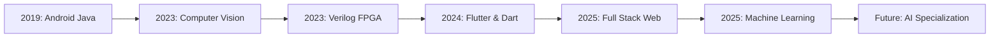

# Hey there! I'm Odai ALtmrawe 👨‍💻⚡

<div align="center">
  
[](https://git.io/typing-svg)


</div>

---

## 🚀 About Me

> *"Transforming ideas into code, one commit at a time"*

🎓 **Computer Engineering Student** at University of Jordan (GPA: 3.45/4.0)  
💼 **Native Android Development Instructor** at Tesla Academy  
👥 **Mobile Team Leader** at Waves JU  
🌟 **Tech Enthusiast** with expertise in mobile development, FPGA design, and AI  

- 🔭 Currently working on **cutting-edge Android applications** and **FPGA hardware designs**
- 🌱 Learning **advanced machine learning** and **computer vision** techniques
- 💡 Passionate about **IoT systems** and **embedded programming**
- ⚡ Fun fact: I built a **dual-issue out-of-order processor** from scratch!


---

## 🛠️ Tech Arsenal

### 💻 Programming Languages
<p align="center">
  
  
  
  
  
  
</p>

### 📱 Mobile & Frontend
<p align="center">
  
  
  
  
  
  
</p>

### 🌐 Backend & Frameworks
<p align="center">
  
  
  
  
</p>

### 🤖 AI & Hardware
<p align="center">
  
  
  
  
</p>

---

## 📊 GitHub Analytics & Contribution Snake

<div align="center">
  
  
</div>

<div align="center">
  
</div>

### 🐍 Contribution Snake
<div align="center">
  
</div>

---

## 🏆 GitHub Trophies
<div align="center">
  
</div>

---

## 📈 Additional Analytics

<div align="center">
  
</div>

<div align="center">
  
</div>

<div align="center">
  
  
</div>

---

## 🚀 Featured Projects

<div align="center">
  
### 🤖 AI & Machine Learning
  
</div>

<table>
<tr>
<td width="50%">

#### 🧠 Chatbot from Scratch
Built intelligent conversational AI using NLP and ML algorithms

**Tech Stack:**
<p>


</p>

```python
def process_user_input(message):
    tokens = tokenize(message)
    intent = classify_intent(tokens)
    response = generate_response(intent)
    return response
```

</td>
<td width="50%">

#### 👋 Hand-Controlled Ball Game  
Computer vision game with gesture recognition

**Tech Stack:**
<p>


</p>

```python
def detect_hand_gesture(frame):
    hand_landmarks = mediapipe.process(frame)
    gesture = classify_gesture(landmarks)
    return gesture
```

</td>
</tr>
</table>

<div align="center">
  
### 📱 Mobile Applications
  
</div>

<table>
<tr>
<td width="50%">

#### 🏆 Voting App - 6th Place Winner
Ranked 6th out of 150 apps in competition

**Tech Stack:**
<p>


</p>

```dart
class VotingScreen extends StatefulWidget {
  @override
  _VotingScreenState createState() => _VotingScreenState();
}
```

</td>
<td width="50%">

#### 🌦️ Weather App & Caller Loop
Native Android applications with API integrations

**Tech Stack:**
<p>


</p>

```java
public class WeatherAPI {
    private String API_KEY = "your_api_key";
    public WeatherData getWeatherData(String city) {
        // API implementation
    }
}
```

</td>
</tr>
</table>

<div align="center">
  
### ⚡ Hardware & FPGA
  
</div>

<table>
<tr>
<td width="50%">

#### 🖥️ Dual-Issue Out-of-Order Processor
Advanced processor architecture in Verilog

**Features:**
- Dual-issue execution
- Out-of-order processing
- Branch prediction
- Cache optimization

```verilog
module dual_issue_processor(
    input clk, rst,
    input [31:0] instruction1, instruction2,
    output [31:0] result1, result2
);
```

</td>
<td width="50%">

#### 🌧️ Rain-Aware Garden Irrigation
IoT-based smart irrigation with weather integration

**Tech Stack:**
<p>


</p>

```c
void checkWeatherAndIrrigate() {
    if (getRainProbability() < THRESHOLD) {
        activateIrrigation();
    }
}
```

</td>
</tr>
</table>

<div align="center">
  
### 🌐 Web & Backend
  
</div>

<table>
<tr>
<td width="50%">

#### 🏥 Client/Server Medical Platform
Secure medical data management system

**Tech Stack:**
<p>


</p>

```php
class MedicalController extends Controller {
    public function secureDataTransfer($data) {
        return encrypt($data);
    }
}
```

</td>
<td width="50%">

#### 🔐 Dubai Automation Project
Confidential automation app with Amazon APIs

**Tech Stack:**
<p>


</p>

```python
import boto3
def analyze_automation_data():
    client = boto3.client('s3')
    # Data processing logic
```

</td>
</tr>
</table>

---

## 📊 Detailed Statistics

<div align="center">
  
</div>

<div align="center">
  
  
</div>

---

## 🎯 Current Focus

<div align="center">
  
</div>

```javascript
const odai = {
    currentRole: "Native Android Instructor & Mobile Team Leader",
    learning: ["Advanced Machine Learning", "Computer Vision", "FPGA Optimization"],
    workingOn: ["Next-gen Android Apps", "AI-powered IoT Systems"],
    hobbies: ["Hardware Tinkering", "Open Source Contributing", "Tech Mentoring"],
    funFact: "I can debug both software AND hardware! 🔧⚡"
};
```

---

## 🏅 Achievements & Certifications

<div align="center">
  
| Achievement | Year | Details |
|-------------|------|---------|
| 🥇 **6th Place Flutter Competition** | 2025 | Out of 150 applications |
| 📱 **Android Instructor** | 2024-Present | Tesla Academy |
| 👥 **Mobile Team Leader** | 2025-Present | Waves JU |
| 🎓 **Computer Engineering** | 2021-Present | GPA: 3.45/4.0 |

</div>

---

## 📚 Learning Journey

<div align="center">
  


</div>

---

## 📫 Let's Connect!

<div align="center">

[](https://linkedin.com/in/odaitmrawe-981a9422a)
[](mailto:adaialtmrawe@gmail.com)
[](tel:+962787366431)
[](https://github.com/odaialtmrawe)

 <em><b>I love connecting with different people</b> so if you want to say <b>hi, I'll be happy to meet you more!</b> :)</em>

</div>

---

## 💭 Random Dev Quote
<div align="center">
  


</div>

---

<div align="center">
  
  
  **⭐ From [Odai ALtmrawe](https://github.com/odaialtmrawe) with 💜**
  
  
  
  *"Code is poetry written in logic"*
</div>

---

## 🎯 2025 Goals Roadmap

- [ ] 🚀 Launch 3 innovative Android applications
- [ ] 🤖 Master advanced AI and computer vision techniques  
- [ ] ⚡ Design and implement complex FPGA systems
- [ ] 📚 Contribute to 10+ open source projects
- [ ] 🌐 Build full-stack applications with modern frameworks
- [ ] 🎓 Complete advanced machine learning specialization
- [ ] 👥 Mentor 50+ junior developers

<div align="center">
  
  ### 🌟 "Innovation distinguishes between a leader and a follower" - Steve Jobs
  
  
  
</div>
