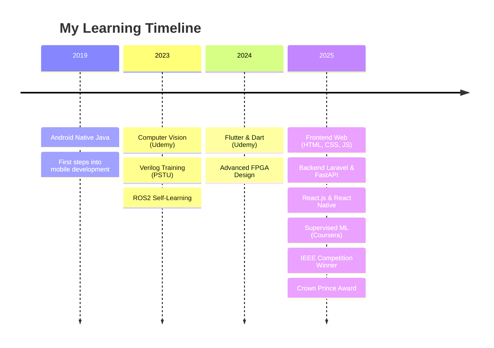

# <div align="center">🌟 Welcome to Odai ALtmrawe's Digital Universe 🌟</div>

<div align="center">
  


</div>

<div align="center">
  
[](https://git.io/typing-svg)


</div>


##  About Me


```javascript
const odai = {
    name: "Odai ALtmrawe",
    title: "Computer Engineer & Mobile Developer",
    location: "Jordan 🇯🇴",
    education: {
        degree: "BS Computer Engineering",
        university: "University of Jordan",
        gpa: "3.45/4.0",
        status: "2021 - Present"
    },
    currentRoles: [
        "📱 Native Android Instructor @ Tesla Academy",
        "👥 Mobile Team Leader @ Waves JU"
    ],
    recentAchievements: [
        "🥉 3rd Place - IEEE MotionSense AI Competition 2025",
        "🏅 6th Place - Crown Prince Award 2025"
    ],
    focus: ["Mobile Development", "FPGA Design", "AI & ML"],
    motto: "Transforming ideas into code, one commit at a time! 🚀"
};
```

- 🔭 Currently working on **cutting-edge Android applications** and **AI-powered solutions**
- 🌱 Learning **advanced machine learning** and **computer vision** techniques
- 💡 Passionate about **IoT systems**, **embedded programming**, and **FPGA design**
- ⚡ Fun fact: I built a **dual-issue out-of-order processor** from scratch!
- 🎯 Goal: Creating technology that makes a positive impact


## 🏆  Awards & Achievements

<div align="center">

<table>
<tr>
<td width="50%" align="center">


### 🥉 IEEE MotionSense AI Competition 2025
**3rd Place Winner**
**Actify: AI-Powered Fitness Tracker**
*Transforming motion data into valuable health insights*

</td>
<td width="50%" align="center">


### 🏅 Crown Prince Award 2025
**6th Place out of 150 Apps**
**Sawtak: Civic Engagement Platform**
*Connecting citizens with decision makers*

</td>
</tr>
</table>

</div>


## 🛠️  Tech Arsenal

<div align="center">

### 💻 Programming Languages
<p>

</p>

### 📱 Mobile Development
<p>

</p>

### 🌐 Web Technologies
<p>

</p>

### 🤖 AI & Machine Learning
<p>

</p>

### ⚡ Hardware & Tools
<p>

</p>

### 🗄️ Databases
<p>

</p>

</div>


## 📊  GitHub Analytics

<div align="center">


</div>

### 🐍 Contribution Snake
<div align="center">
  
</div>

### 📈 Activity Graph
<div align="center">
  
</div>


## 🏅  GitHub Trophies

<div align="center">
  
</div>


## 🚀  Featured Projects

<div align="center">

### 🤖 AI & Machine Learning Projects

</div>

<table>
<tr>
<td width="50%">

<div align="center">

</div>

#### 🧠 Actify - AI Fitness Tracker
**🥉 3rd Place IEEE Competition Winner**

Transform your motion data into actionable health insights using advanced AI algorithms.

**Tech Stack:**
<p>

</p>

```python
class MotionSenseAI:
    def __init__(self):
        self.model = load_trained_model()
    
    def analyze_motion(self, sensor_data):
        insights = self.model.predict(sensor_data)
        return generate_health_recommendations(insights)
```

**Features:**
- 🏃‍♂️ Real-time activity recognition
- 📊 Health insights dashboard
- 🎯 Personalized recommendations
- 📱 Cross-platform mobile app

</td>
<td width="50%">

<div align="center">

</div>

#### 🗳️ Sawtak - Civic Engagement Platform
**🏅 6th Place Crown Prince Award**

Connecting citizens with decision makers through digital democracy.

**Tech Stack:**
<p>

</p>

```dart
class SawtakApp extends StatelessWidget {
  @override
  Widget build(BuildContext context) {
    return MaterialApp(
      title: 'Sawtak - Your Voice Matters',
      home: CivicEngagementDashboard(),
    );
  }
}
```

**Features:**
- 🏛️ Government integration
- 📝 Digital voting system
- 💬 Citizen feedback portal
- 📊 Real-time analytics

</td>
</tr>
</table>

<div align="center">

### 📱 Mobile Applications

</div>

<table>
<tr>
<td width="50%">

<div align="center">

</div>

#### 🌦️ Smart Weather & Caller App
Native Android applications with advanced features

**Tech Stack:**
<p>

</p>

```java
public class WeatherService {
    private WeatherAPI weatherAPI;
    
    public WeatherData getCurrentWeather(String location) {
        return weatherAPI.fetchWeatherData(location);
    }
    
    public void setupSmartNotifications() {
        // Advanced notification system
    }
}
```

**Features:**
- 🌡️ Real-time weather data
- 📞 Smart call management
- 🔔 Intelligent notifications
- 🎨 Material Design UI

</td>
<td width="50%">

<div align="center">

</div>

#### 🎮 Flutter Gaming Suite
Interactive Bluetooth-enabled games

**Tech Stack:**
<p>

</p>

```dart
class BluetoothGameController {
  BluetoothConnection? connection;
  
  Future<void> connectToDevice() async {
    connection = await BluetoothConnection.toAddress(deviceAddress);
    startGameSession();
  }
  
  void handleJoystickInput(JoystickData data) {
    // Process gaming input
  }
}
```

**Features:**
- 🎮 Joystick control interface
- 💬 Real-time chat system
- 🔗 Bluetooth connectivity
- 🏆 Multiplayer gaming

</td>
</tr>
</table>

<div align="center">

### ⚡ Hardware & FPGA Projects

</div>

<table>
<tr>
<td width="50%">

<div align="center">

</div>

#### 🖥️ Dual-Issue Out-of-Order Processor
Advanced processor architecture in Verilog

**Features:**
- ⚡ Dual-issue execution engine
- 🔄 Out-of-order processing
- 🧠 Branch prediction unit
- 💾 Advanced cache optimization

```verilog
module dual_issue_processor(
    input clk, rst,
    input [31:0] instruction1, instruction2,
    output [31:0] result1, result2,
    output reg pipeline_stall
);

// Instruction decode and dispatch logic
always @(posedge clk) begin
    if (!pipeline_stall) begin
        // Dual instruction processing
        dispatch_unit(instruction1, instruction2);
    end
end

endmodule
```

</td>
<td width="50%">

<div align="center">

</div>

#### 🌧️ Smart Irrigation System
IoT-based weather-aware garden automation

**Features:**
- 🌦️ Weather API integration
- 💧 Smart water management
- 📊 Real-time monitoring
- 🔌 IoT connectivity

```c
#include <stdio.h>
#include <wifi.h>
#include <sensors.h>

void smartIrrigation() {
    float rainfall_prob = getWeatherData();
    float soil_moisture = readSoilSensor();
    
    if (rainfall_prob < RAIN_THRESHOLD && 
        soil_moisture < MOISTURE_THRESHOLD) {
        activateIrrigation();
        logActivity("Irrigation activated");
    }
}
```

</td>
</tr>
</table>

<div align="center">

### 🌐 Web & Backend Projects

</div>

<table>
<tr>
<td width="50%">

<div align="center">

</div>

#### 🏥 Medical Platform
Secure client-server medical data management

**Tech Stack:**
<p>

</p>

```php
<?php

class MedicalController extends Controller {
    public function secureDataTransfer(Request $request) {
        $encryptedData = encrypt($request->medicalData);
        
        // TCP secure transmission
        return response()->json([
            'status' => 'secure_transfer_complete',
            'data' => $encryptedData
        ]);
    }
    
    public function generateHealthReport($patientId) {
        return HealthReportService::generate($patientId);
    }
}
```

**Features:**
- 🔐 End-to-end encryption
- 👨‍⚕️ Multi-role authentication
- 📊 Health analytics dashboard
- 🏥 Hospital integration

</td>
<td width="50%">

<div align="center">

</div>

#### 🤖 Intelligent Chatbot
NLP-powered conversational AI from scratch

**Tech Stack:**
<p>

</p>

```python
class IntelligentChatbot:
    def __init__(self):
        self.nlp_model = self.load_trained_model()
        self.context_manager = ContextManager()
    
    def process_message(self, user_input):
        intent = self.classify_intent(user_input)
        context = self.context_manager.get_context()
        
        response = self.generate_response(intent, context)
        self.context_manager.update_context(user_input, response)
        
        return response
    
    def continuous_learning(self, feedback):
        self.retrain_model(feedback)
```

**Features:**
- 🧠 Advanced NLP processing
- 💬 Context-aware conversations
- 📈 Continuous learning
- 🎯 Intent classification

</td>
</tr>
</table>


## 🎓  Learning Journey & Certifications

<div align="center">



</div>

<div align="center">

### 📚 Certification Timeline

| Year | Certification | Institution | Status |
|------|---------------|-------------|---------|
| 2019 | Android Native Programming | Self-Study | ✅ Completed |
| 2023 | Computer Vision | Udemy | ✅ Completed |
| 2023 | Verilog Training | PSTU | ✅ Completed |
| 2024 | Flutter & Dart | Udemy | ✅ Completed |
| 2025 | Full Stack Web Development | Multiple | ✅ Completed |
| 2025 | Supervised Machine Learning | Coursera | ✅ Completed |

</div>


## 📈  Detailed Analytics

<div align="center">


</div>


## 🎯  Current Focus & Goals

<div align="center">
  
</div>

### 🚀 2025 Roadmap

- [ ] 🎯 **Launch Actify**: Deploy AI fitness tracker to app stores
- [ ] 🏛️ **Expand Sawtak**: Scale civic engagement platform
- [ ] 🤖 **Master Advanced ML**: Complete specialized AI courses
- [ ] ⚡ **FPGA Innovation**: Design next-gen processor architecture
- [ ] 🌐 **Open Source**: Contribute to 15+ projects
- [ ] 📚 **Knowledge Sharing**: Publish technical articles
- [ ] 👥 **Community Building**: Mentor junior developers
- [ ] 🎪 **Startup Launch**: Transform award-winning projects into products

### 💡 Current Learning Focus

```javascript
const learningPath2025 = {
    primary: [
        "Advanced Computer Vision 👁️",
        "Edge AI & IoT Integration 🔌", 
        "Quantum Computing Fundamentals ⚛️",
        "Advanced FPGA Architecture ⚡"
    ],
    secondary: [
        "DevOps & Cloud Architecture ☁️",
        "Blockchain Development 🔗",
        "AR/VR Development 🥽",
        "Technical Leadership 👑"
    ],
    goals: {
        competitions: "Win international tech competitions 🏆",
        impact: "Create technology that changes lives 🌍",
        community: "Build a strong developer community 🤝"
    }
};
```


## 📫  Let's Connect!

<div align="center">


### 🌐 Find Me Across The Internet

[](https://www.linkedin.com/in/odai-tmrawe-981a9422a/)
[](adaialtmrawe@gmail.com)
[](tel:+962787366431)
[](https://github.com/odaialtmrawe)


</div>

---

<div align="center">

### 💭 Random Dev Quote


</div>

---

<div align="center">


**⭐ From [Odai ALtmrawe](https://github.com/odaialtmrawe) with 💜**


*"Innovation distinguishes between a leader and a follower"* - Steve Jobs

### 🌟 Made with ❤️ and lots of ☕ 

</div>
