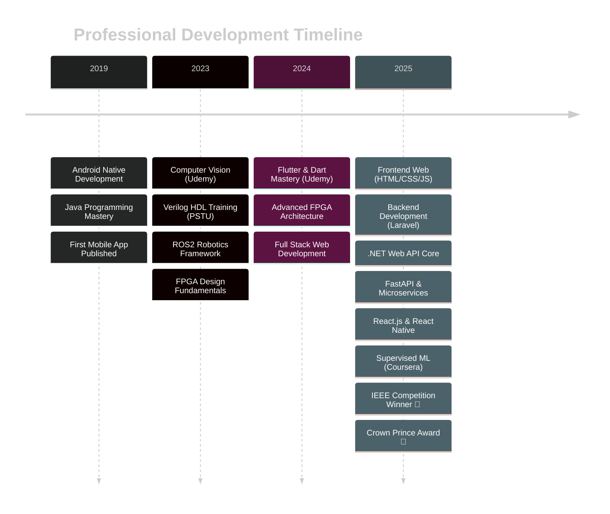

<div align="center">

<!-- Animated Header -->


<!-- Typing Animation -->
<a href="https://git.io/typing-svg"></a>

<!-- Profile Views & Social Badges -->
<p align="center">
  
  
  
</p>

<!-- Quick Links -->
<p align="center">
  <a href="#-about-me">About</a> •
  <a href="#-trophy-case">Awards</a> •
  <a href="#-tech-stack">Tech Stack</a> •
  <a href="#-featured-projects">Projects</a> •
  <a href="#-connect-with-me">Connect</a>
</p>

</div>

<br>

<!-- Animated Divider -->


##  About Me


```typescript
const odaiAltmrawe = {
    identity: {
        name: "Odai ALtmrawe",
        role: "Computer Engineer | Award-Winning Developer",
        location: "Jordan 🇯🇴",
        motto: "Code. Create. Innovate. Repeat. 🚀"
    },
    
    education: {
        degree: "BS in Computer Engineering",
        university: "University of Jordan",
        gpa: "3.45/4.0",
        period: "2021 - Present"
    },
    
    currentEngagements: [
        "📱 Native Android Instructor @ Tesla Academy",
        "👨‍💼 Mobile Team Leader @ Waves JU",
        "🏆 IEEE Competition Champion (3rd Place)",
        "🎖️ Crown Prince Award Finalist (6th/150)"
    ],
    
    expertise: {
        mobile: ["Android Native", "Flutter", "React Native"],
        backend: ["Laravel", "FastAPI", ".NET Web API Core", "Node.js"],
        ai_ml: ["TensorFlow", "PyTorch", "Computer Vision", "NLP"],
        hardware: ["FPGA Design", "Verilog", "Embedded Systems"],
        web: ["React.js", "HTML/CSS/JS", "Full Stack Development"]
    },
    
    achievements: [
        "🥉 3rd Place - IEEE MotionSense AI Competition 2025",
        "🏅 6th Place - Crown Prince Award 2025 (150+ apps)",
        "⚡ Built dual-issue out-of-order processor from scratch",
        "🎯 Multiple award-winning mobile applications"
    ],
    
    currentFocus: [
        "Advanced AI/ML implementations",
        "Scalable mobile architectures", 
        "FPGA processor design",
        "Transforming award-winning projects into startups"
    ],
    
    funFact: "I design processors at the hardware level and " +
             "build AI apps at the software level! 🧠⚡"
};
```

<br>

<!-- Animated Divider -->


## 🏆 Trophy Case

<div align="center">

<!-- GitHub Trophies -->


</div>

### 🎖️ Competition Achievements

<table>
<tr>
<td width="50%" valign="top">

#### 🥉 IEEE MotionSense AI Competition 2025


**🏆 3rd Place Winner**
- **Project:** Actify - AI-Powered Fitness Tracker
- **Achievement:** Beat 50+ teams with cutting-edge ML
- **Impact:** Real-time motion analysis & health insights
- **Tech:** TensorFlow, Flutter, Sensor Fusion

</td>
<td width="50%" valign="top">

#### 🏅 Crown Prince Award 2025


**🎖️ 6th Place out of 150 Apps**
- **Project:** Sawtak - Civic Engagement Platform
- **Achievement:** National recognition for social impact
- **Impact:** Connecting citizens with decision-makers
- **Tech:** Flutter, Firebase, Node.js, Real-time Analytics

</td>
</tr>
</table>

<br>

<!-- Animated Divider -->


## 🛠️ Tech Stack

<div align="center">

### 💻 Languages & Frameworks

<table>
<tr>
<td align="center" width="25%">
<h4>Mobile Development</h4>
<br>


</td>
<td align="center" width="25%">
<h4>Web Development</h4>
<br>


</td>
<td align="center" width="25%">
<h4>Backend & APIs</h4>
<br>


</td>
<td align="center" width="25%">
<h4>AI & Machine Learning</h4>
<br>


</td>
</tr>
</table>

### ⚡ Hardware & Systems

<table>
<tr>
<td align="center" width="33%">
<h4>FPGA & HDL</h4>
<br>


</td>
<td align="center" width="33%">
<h4>Embedded Systems</h4>
<br>


</td>
<td align="center" width="33%">
<h4>Databases & Cloud</h4>
<br>


</td>
</tr>
</table>

### 🧰 Tools & Technologies

<p align="center">

</p>

<p align="center">


</p>

</div>

<br>

<!-- Animated Divider -->


## 🚀 Featured Projects

<div align="center">

### 🤖 AI & Machine Learning

</div>

<table>
<tr>
<td width="50%">

<h3 align="center">🧠 Actify - AI Fitness Tracker</h3>

<div align="center">

<br><br>

[](https://github.com/odaialtmrawe)
[](https://github.com/odaialtmrawe)
[](https://github.com/odaialtmrawe)

**🥉 IEEE Competition Winner | 3rd Place**

Transform your motion data into actionable health insights using advanced AI algorithms and real-time sensor fusion.

**Key Features:**
- 🏃‍♂️ Real-time activity recognition
- 📊 Personalized health insights
- 🎯 ML-powered recommendations
- 📱 Cross-platform mobile app
- 🔄 Continuous model improvement

**Tech Highlights:**
- Custom TensorFlow ML models
- Sensor data preprocessing pipeline
- Real-time inference optimization
- Flutter-based responsive UI

</div>

</td>
<td width="50%">

<h3 align="center">🗳️ Sawtak - Civic Platform</h3>

<div align="center">

<br><br>

[](https://github.com/odaialtmrawe)
[](https://github.com/odaialtmrawe)
[](https://github.com/odaialtmrawe)

**🏅 Crown Prince Award | Top 6 out of 150**

Bridging the gap between citizens and decision-makers through innovative digital democracy.

**Key Features:**
- 🏛️ Government integration
- 📝 Secure digital voting
- 💬 Real-time feedback portal
- 📊 Advanced analytics dashboard
- 🔐 End-to-end encryption

**Tech Highlights:**
- Scalable Firebase architecture
- Real-time data synchronization
- Advanced security protocols
- Government API integrations

</div>

</td>
</tr>
</table>

<div align="center">

### 📱 Mobile Applications

</div>

<table>
<tr>
<td width="50%">

<h3 align="center">🌦️ Smart Weather & Caller</h3>

<div align="center">

<br><br>

[](https://github.com/odaialtmrawe)
[](https://github.com/odaialtmrawe)

Native Android applications with advanced features and Material Design principles.

**Features:**
- 🌡️ Real-time weather forecasting
- 📞 Intelligent call management
- 🔔 Smart notification system
- 🎨 Beautiful Material Design UI
- 📍 Location-based services

</div>

</td>
<td width="50%">

<h3 align="center">🎮 Flutter Gaming Suite</h3>

<div align="center">

<br><br>

[](https://github.com/odaialtmrawe)
[](https://github.com/odaialtmrawe)

Interactive Bluetooth-enabled multiplayer games with real-time communication.

**Features:**
- 🎮 Joystick control interface
- 💬 Real-time chat system
- 🔗 Bluetooth connectivity
- 🏆 Multiplayer gaming
- 🎯 Smooth animations

</div>

</td>
</tr>
</table>

<div align="center">

### ⚡ Hardware & FPGA

</div>

<table>
<tr>
<td width="50%">

<h3 align="center">🖥️ Dual-Issue OoO Processor</h3>

<div align="center">

<br><br>

[](https://github.com/odaialtmrawe)
[](https://github.com/odaialtmrawe)

Advanced processor architecture designed and implemented in Verilog HDL.

**Architecture:**
- ⚡ Dual-issue execution engine
- 🔄 Out-of-order processing
- 🧠 Dynamic branch prediction
- 💾 Multi-level cache hierarchy
- 🎯 Performance optimization

</div>

</td>
<td width="50%">

<h3 align="center">🌧️ Smart Irrigation System</h3>

<div align="center">

<br><br>

[](https://github.com/odaialtmrawe)
[](https://github.com/odaialtmrawe)

IoT-based weather-aware automated garden irrigation system.

**Features:**
- 🌦️ Weather API integration
- 💧 Smart water management
- 📊 Real-time monitoring
- 🔌 IoT connectivity
- 📈 Data analytics

</div>

</td>
</tr>
</table>

<div align="center">

### 🌐 Web & Backend

</div>

<table>
<tr>
<td width="50%">

<h3 align="center">🏥 Medical Platform</h3>

<div align="center">

<br><br>

[](https://github.com/odaialtmrawe)
[](https://github.com/odaialtmrawe)
[](https://github.com/odaialtmrawe)

Secure client-server medical data management system.

**Features:**
- 🔐 End-to-end encryption
- 👨‍⚕️ Multi-role authentication
- 📊 Health analytics dashboard
- 🏥 Hospital system integration
- 📱 Responsive design

</div>

</td>
<td width="50%">

<h3 align="center">🤖 Intelligent Chatbot</h3>

<div align="center">

<br><br>

[](https://github.com/odaialtmrawe)
[](https://github.com/odaialtmrawe)

NLP-powered conversational AI built from scratch.

**Features:**
- 🧠 Advanced NLP processing
- 💬 Context-aware conversations
- 📈 Continuous learning
- 🎯 Intent classification
- 🔄 Self-improving algorithms

</div>

</td>
</tr>
</table>

<br>

<!-- Animated Divider -->


## 📊 GitHub Analytics

<div align="center">


<!-- Contribution Snake -->


</div>

<br>

<!-- Animated Divider -->


## 🎓 Learning Journey & Certifications

<div align="center">



</div>

### 📚 Certification Portfolio

<div align="center">

| Year | Certification | Platform | Technology Focus | Status |
|:----:|---------------|----------|------------------|:------:|
| 2019 | **Android Native Programming** | Self-Study | Java, Android SDK | ✅ |
| 2023 | **Computer Vision** | Udemy | OpenCV, Image Processing | ✅ |
| 2023 | **Verilog HDL Training** | PSTU | FPGA, Digital Design | ✅ |
| 2023 | **ROS2 Framework** | Self-Study | Robotics, Autonomous Systems | ✅ |
| 2024 | **Flutter & Dart Development** | Udemy | Cross-Platform Mobile | ✅ |
| 2024 | **Advanced FPGA Design** | Self-Study | Hardware Architecture | ✅ |
| 2025 | **Full Stack Web Development** | Multiple | MERN, Laravel, .NET | ✅ |
| 2025 | **.NET Web API Core** | Online Course | Backend APIs, C# | ✅ |
| 2025 | **Supervised Machine Learning** | Coursera | ML Algorithms, Python | ✅ |

</div>

<br>

<!-- Animated Divider -->


## 🎯 Current Focus & 2025 Roadmap

<div align="center">

</div>

<table>
<tr>
<td width="50%" valign="top">

### 🚀 Active Projects

- [x] **Actify Deployment** - Launching AI fitness tracker
- [x] **Sawtak Expansion** - Scaling civic platform
- [ ] **FPGA Innovation** - Next-gen processor design
- [ ] **Startup Launch** - Commercializing award winners
- [ ] **Open Source** - Contributing to 15+ projects
- [ ] **Technical Writing** - Publishing research articles

</td>
<td width="50%" valign="top">

### 📚 Learning Focus

**Primary:**
- 🧠 Advanced Computer Vision & Deep Learning
- 🔌 Edge AI & IoT Integration
- ⚛️ Quantum Computing Fundamentals
- ⚡ Advanced FPGA Architecture

**Secondary:**
- ☁️ DevOps & Cloud Architecture (AWS, Azure)
- 🔗 Blockchain & Smart Contracts
- 🥽 AR/VR Development
- 👑 Technical Leadership & Mentoring

</td>
</tr>
</table>

<div align="center">

### 💡 Vision for 2025

```javascript
const vision2025 = {
    technical: {
        master: ["Advanced AI/ML", "Edge Computing", "Quantum Basics"],
        build: ["Production-ready apps", "Scalable systems", "Open source tools"],
        innovate: ["Novel algorithms", "Efficient architectures", "Real-world solutions"]
    },
    
    professional: {
        achieve: ["Win international competitions", "Launch tech startup"],
        grow: ["Mentor 50+ developers", "Speak at tech conferences"],
        impact: ["Create jobs", "Solve real problems", "Give back to community"]
    },
    
    personal: {
        learn: "Never stop learning new technologies",
        share: "Knowledge grows when shared",
        inspire: "Be the developer you needed when starting"
    },
    
    motto: "Building the future, one commit at a time 🚀"
};
```

</div>

<br>

<!-- Animated Divider -->


## 📫 Connect With Me

<div align="center">


### Let's Build Something Amazing Together! 🚀

<p align="center">
<a href="https://www.linkedin.com/in/odai-tmrawe-981a9422a/">
  
</a>
<a href="mailto:adaialtmrawe@gmail.com">
  
</a>
<a href="https://wa.me/962787366431">
  
</a>
<a href="https://github.com/odaialtmrawe">
  
</a>
</p>

<br>

### 💬 Open For

<p align="center">


</p>

<br>

### 📧 Reach Me At

<p align="center">
<b>Email:</b> adaialtmrawe@gmail.com<br>
<b>Phone:</b> +962 787 366 431<br>
<b>Location:</b> Jordan 🇯🇴
</p>

</div>

<br>

<!-- Animated Divider -->


## 💭 Developer Wisdom

<div align="center">


<br>

### 🌟 Personal Motto

> *"Innovation distinguishes between a leader and a follower."*  
> **— Steve Jobs**

<br>

> *"The best way to predict the future is to invent it."*  
> **— Alan Kay**

<br>

### ⚡ Quick Stats


</div>

<br>

<!-- Animated Divider -->


<div align="center">

### 🙏 Thank You for Visiting!


<br>

**If you like my work, consider:**

<p>
<a href="https://github.com/odaialtmrawe">
  
</a>
<a href="https://github.com/odaialtmrawe">
  
</a>
<a href="https://www.linkedin.com/in/odai-tmrawe-981a9422a/">
  
</a>
</p>

<br>

### 💜 Made with passion, powered by coffee ☕


<br><br>

<!-- Footer Wave -->


</div>
